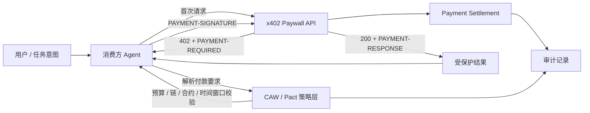
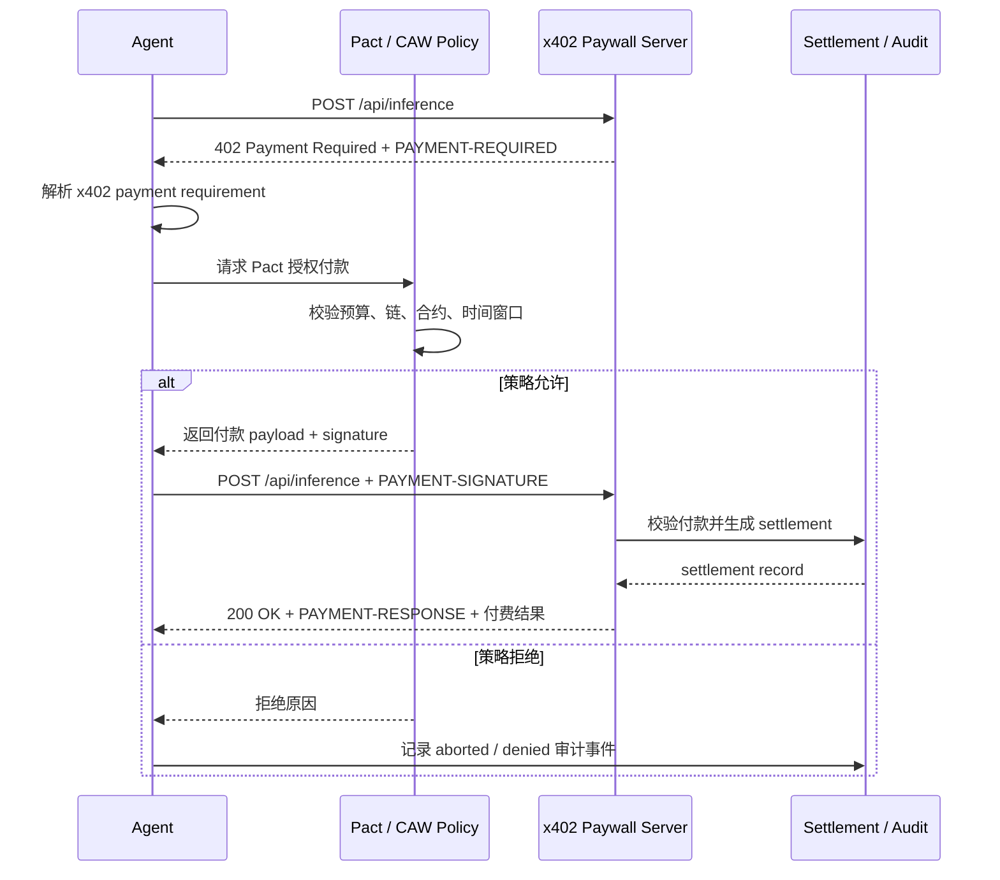

# x402 Paywall + CAW Agent 自主支付闭环

这个实验搭建了一个最小化的 agent commerce 支付闭环，用来展示：

- 服务提供方提供受 x402 保护的 API 或 AI 推理服务；
- 消费方 agent 首次请求时收到 `402 Payment Required`；
- agent 自动解析付款要求；
- CAW / Pact 风格策略限制预算、链、合约和时间窗口；
- 策略通过后，agent 发起付款并重试请求；
- 服务端完成 settlement，记录审计日志，并返回受保护结果。

重点不是“让 agent 自动付款”，而是展示 agent 只能在明确授权、预算控制和可审计记录下完成自动交易。

## 运行方式

```bash
npm test
npm run demo
npm run demo:http
```

推荐先运行：

```bash
npm run demo:http
```

该命令会启动本地 HTTP paywall 服务，agent 请求 `/api/inference` 后收到 `402`，随后在 Pact 允许的范围内生成付款签名，再次请求并获得付费接口结果。命令结束后会打印 settlement 和审计记录，并自动关闭本地服务。

## 架构图



本实验中的 CAW / Pact 是本地模型，用于表达真实 CAW 集成中的控制面：

- `maxUsd`：任务总预算；
- `perPaymentUsd`：单笔付款上限；
- `allowedNetworks`：允许操作的链；
- `allowedContracts`：允许调用或支付的合约 / 收款目标；
- `validForSeconds`：授权有效期；
- `audit`：记录 Pact 创建、策略校验、付款签名、结算结果等事件。

## 交互流程



对应到代码中的最小闭环：

1. `src/http-agent.js` 使用 `fetch` 调用 paywall API；
2. `src/http-server.js` 将本地 paywall 暴露为 HTTP 服务；
3. `src/server.js` 在未付款时返回 `402` 和 `PAYMENT-REQUIRED`；
4. `src/pact.js` 校验付款要求是否在 Pact 边界内；
5. Pact 允许后，agent 带 `PAYMENT-SIGNATURE` 重试请求；
6. 服务端验证付款 payload，生成 settlement 和 `PAYMENT-RESPONSE`；
7. agent 获得受保护结果，审计记录保留完整执行链路。

## 关键接口说明

### `POST /api/inference`

受 x402 paywall 保护的付费 AI 推理接口。

未携带付款信息时返回：

```http
HTTP/1.1 402 Payment Required
PAYMENT-REQUIRED: <base64url-encoded-json>
content-type: application/json
```

响应体示例：

```json
{
  "error": "payment_required",
  "accepts": [
    {
      "x402Version": 2,
      "scheme": "exact",
      "network": "eip155:84532",
      "token": "USDC",
      "priceUsd": "0.001",
      "payTo": "0x1111111111111111111111111111111111111111",
      "contract": "0x2222222222222222222222222222222222222222",
      "description": "Paid AI inference demo endpoint",
      "mimeType": "application/json",
      "requirementHash": "...",
      "requestId": "..."
    }
  ]
}
```

携带付款信息后重试：

```http
POST /api/inference
PAYMENT-SIGNATURE: <base64url-encoded-payment-payload>
content-type: application/json
```

成功后返回：

```http
HTTP/1.1 200 OK
PAYMENT-RESPONSE: <base64url-encoded-settlement>
content-type: application/json
```

响应体示例：

```json
{
  "paid": true,
  "result": "This paid response explains that agent commerce is automatic execution bounded by explicit authorization, budget, and auditability.",
  "input": {
    "prompt": "summarize agent commerce in one sentence"
  }
}
```

### Pact 策略接口

核心函数：

```js
createDemoPact({
  maxUsd: "0.01",
  allowedNetworks: ["eip155:84532"],
  allowedContracts: ["0x2222222222222222222222222222222222222222"],
  validForSeconds: 600
});
```

该 Pact 会拒绝以下行为：

- 付款金额超过总预算；
- 付款金额超过单笔上限；
- x402 要求的链不在允许列表中；
- x402 要求的合约或收款目标不在允许列表中；
- Pact 已过期。

付款授权函数：

```js
authorizePaymentWithPact(pact, paymentRequirement);
```

授权成功时返回 payment payload；授权失败时抛出拒绝原因，例如：

```text
Pact denied payment: amount_exceeds_budget
```

### Settlement 与审计记录

服务端 settlement 示例：

```json
{
  "id": "settlement_0001",
  "status": "settled",
  "protocol": "x402",
  "network": "eip155:84532",
  "amountUsd": "0.001",
  "payTo": "0x1111111111111111111111111111111111111111",
  "pactId": "pact_...",
  "txHash": "..."
}
```

审计事件包括：

- `pact_created`：用户围绕任务创建授权边界；
- `payment_required`：服务端返回 x402 付款要求；
- `pact_check`：CAW / Pact 策略允许或拒绝付款；
- `payment_signed`：agent 在授权范围内生成付款 payload；
- `payment_settled`：服务端完成 settlement；
- `payment_aborted`：策略拒绝后 agent 停止付款。

## 文件结构

| 文件 | 作用 |
| --- | --- |
| `src/server.js` | x402-style paywall、付款校验、settlement 生成 |
| `src/http-server.js` | 将 paywall 暴露为本地 HTTP 服务 |
| `src/pact.js` | CAW / Pact 风格预算、链、合约、时间窗口校验 |
| `src/http-agent.js` | HTTP agent：识别 `402`、请求 Pact 授权、付款重试 |
| `src/agent.js` | 进程内 agent 闭环，便于测试核心逻辑 |
| `src/demo.js` | 进程内 demo |
| `src/http-demo.js` | 本地 HTTP demo |
| `test/*.test.js` | 覆盖允许付款和预算拒绝两条路径 |

## 风险边界

这个实验是最小可运行 proof-of-work，不是生产级支付系统。

已经覆盖：

- x402 风格的 `402 Payment Required`；
- agent 自动解析付款要求；
- CAW / Pact 风格的预算、链、合约、时间窗口限制；
- 付款 payload 生成和重试；
- settlement 记录；
- 可追溯审计日志；
- 付款成功后获取受保护结果；
- 超预算时拒绝付款。

没有覆盖：

- 真实 CAW API 调用；
- 真实链上 USDC 转账；
- 真实 x402 SDK / facilitator；
- 真实钱包签名；
- escrow 托管；
- evaluator 验收；
- reputation；
- dispute resolution；
- slashing 或退款；
- 私钥、密钥管理和生产安全策略。

真实接入时需要替换两处：

1. 将 `authorizePaymentWithPact` 中的本地签名替换为 CAW 的 Pact-scoped payment operation，并读取 CAW 审计和交易记录；
2. 将 `src/server.js` 中的本地 settlement 替换为官方 x402 SDK middleware、facilitator 和真实链上结算。

因此，本实验适合用来理解“agent 在明确授权和可审计边界内自动完成付款”的链路，不适合作为真实资金系统直接部署。
