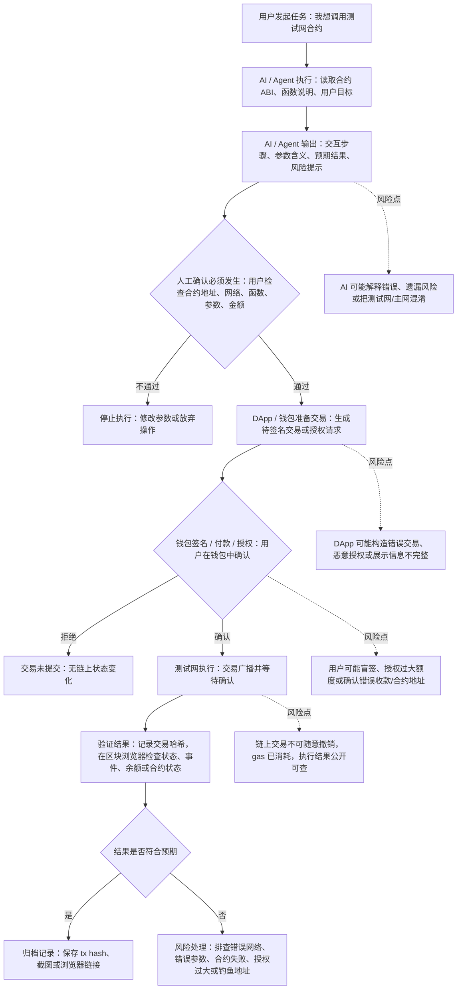

# 最小 AI x Web3 工作流：合约交互前的人机边界

这个流程选择一个最小场景：用户想在测试网上调用某个智能合约，但先让 AI 帮忙解释交互含义、风险和检查项。核心边界是：AI 可以辅助理解和准备，不能替用户签名、付款或授权；真正改变链上状态的动作必须由钱包持有人人工确认。

## 角色和边界

| 步骤 | 谁发起 | 谁执行 | 是否需要人工确认 | 是否需要钱包签名 / 付款 / 授权 | 如何验证 |
| --- | --- | --- | --- | --- | --- |
| 提出交互目标 | 用户 | 用户 | 是，目标要由用户自己定义 | 否 | 检查任务描述是否清楚 |
| 生成合约交互说明 | 用户触发 | AI / Agent | 需要人工复核输出 | 否 | 对照官方文档、合约地址、ABI、测试网信息 |
| 准备交易请求 | 用户或 DApp | DApp / 钱包 / Agent 工具 | 是，检查网络、地址、函数、参数、金额 | 可能需要授权准备，但还未最终签名 | 钱包弹窗和交易预览 |
| 钱包确认 | 用户 | 钱包用私钥签名，链上节点执行交易 | 必须人工确认 | 是，这是关键边界 | 钱包记录和交易哈希 |
| 链上执行与验证 | 用户提交后 | 区块链网络执行，区块浏览器展示结果 | 失败或异常时需要人工判断 | 已经完成签名或付款 | 区块浏览器、事件日志、余额或合约状态 |

## 说明

这个流程解决的是“AI 可以帮我理解链上操作，但不能替我承担签名后果”的边界问题。AI / Agent 辅助的部分包括读取合约信息、解释函数参数、生成操作步骤、提示常见风险和整理验证清单。必须人工确认的部分包括交互目标、合约地址、网络、函数参数、金额、授权额度，以及钱包弹窗里的最终签名或付款。最终结果要用交易哈希在区块浏览器验证，重点查看交易状态、调用的合约地址、事件日志、余额变化和授权记录。主要风险点是 AI 幻觉、DApp 构造恶意交易、用户盲签、授权额度过大、测试网和主网混淆，以及链上交易确认后难以撤销。
