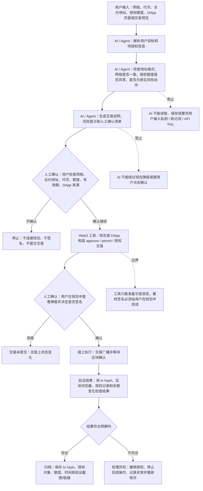

# 受限 Web3 助手 Workflow：代币授权前检查助手

这个 workflow 设计一个“代币授权前检查助手”。用户准备在 DApp 中授权某个合约使用自己的 ERC-20 代币时，AI 只负责解释、检查和生成确认清单，不接触私钥、助记词、API Key，也不自动完成签名、授权、转账或合约写入。

核心原则是：AI 可以辅助判断“这笔操作看起来像什么”，但不能代替用户承担“我确认授权”的责任。

## Workflow 图

## 1. 用户输入是什么

用户需要提供的是可以公开或可检查的信息，而不是密钥类信息：

| 输入 | 示例 | 是否可以给 AI |
| --- | --- | --- |
| 网络 | Ethereum Sepolia、Base、Polygon | 可以 |
| 代币名称和地址 | USDC 合约地址 | 可以，但要再次核对来源 |
| 授权对象 | DApp 或合约地址 | 可以 |
| 授权额度 | 100 USDC 或 unlimited allowance | 可以 |
| 钱包交易预览截图 / 文本 | 钱包弹窗中的函数、地址、金额 | 可以，但不要包含敏感信息 |
| 私钥、助记词、钱包密码、API Key | 12/24 个助记词、private key | 不可以 |

## 2. AI / Agent 做什么

AI / Agent 可以做辅助判断和准备工作：

- 解释这次操作是转账、授权、签名登录，还是合约写入。
- 说明 `approve`、`permit`、授权额度、spender、token address 等字段的含义。
- 检查用户输入里的网络、合约地址、代币地址是否前后一致。
- 提醒用户关注无限授权、陌生合约、钓鱼 DApp、错误网络、地址相似等风险。
- 生成一份钱包确认前的检查清单。
- 在交易完成后，根据交易哈希指导用户检查区块浏览器结果。

AI / Agent 不能做的事：

- 不能要求用户输入或上传私钥、助记词、钱包密码、API Key。
- 不能自动连接钱包并替用户签名。
- 不能绕过人工确认完成授权、转账、合约写入或消息签名。
- 不能把“看起来安全”当作最终安全结论，只能输出风险提示和检查建议。

## 3. Web3 工具或链上步骤是什么

这个 workflow 中可能用到的 Web3 工具和链上步骤包括：

| 阶段 | 工具 / 链上步骤 | 作用 |
| --- | --- | --- |
| 信息检查 | 区块浏览器、合约 ABI、DApp 官方文档 | 查看合约地址、函数含义、项目来源 |
| 交易准备 | DApp、钱包、前端 SDK | 构造待签名的授权交易 |
| 人工签名 | MetaMask、Rabby、OKX Wallet 等钱包 | 用户在钱包里确认或拒绝 |
| 链上执行 | 区块链网络 | 执行 `approve`、`permit` 或其他写入操作 |
| 结果验证 | Etherscan、Blockscout、DeBank、Revoke.cash | 查询交易状态、授权额度和资产变化 |

## 4. 哪些步骤必须人工确认

以下步骤必须由用户人工确认，不能交给 AI 自动执行：

- 是否连接钱包。
- 是否信任当前 DApp 来源。
- 是否确认当前网络正确。
- 是否确认代币地址和授权对象地址正确。
- 是否接受授权额度，尤其是无限授权。
- 是否点击钱包弹窗里的签名、授权、转账或确认按钮。
- 是否在发现异常后撤销授权或停止后续操作。

其中最关键的边界是钱包弹窗。只要涉及签名、授权、转账、合约写入，AI 最多只能解释弹窗内容和风险，最终按钮必须由用户自己点击。

## 5. 如何验证执行结果

执行后不能只相信 DApp 页面提示，需要用链上证据验证：

1. 从钱包或 DApp 复制交易哈希。
2. 在对应网络的区块浏览器中打开交易哈希。
3. 检查交易状态是否为成功，网络是否正确。
4. 检查调用的合约地址是否和预期一致。
5. 检查事件日志或授权记录，确认 spender、token、allowance 是否符合预期。
6. 检查钱包余额是否发生不合理变化。
7. 如为授权操作，可用 Revoke.cash 或钱包内置授权管理功能再次确认当前授权额度。
8. 保存交易哈希、区块浏览器链接和人工确认记录，方便以后追溯。

## 6. 风险和限制

| 风险 / 限制 | 说明 | 缓解方式 |
| --- | --- | --- |
| AI 幻觉 | AI 可能错误解释函数、项目背景或地址来源 | 对照官方文档、区块浏览器和钱包预览 |
| 钓鱼 DApp | 页面可能伪装成知名项目并构造恶意授权 | 只从官方渠道进入，核对域名和合约地址 |
| 无限授权 | `unlimited allowance` 可能让合约长期转走代币 | 尽量使用最小额度，操作后及时撤销 |
| 错误网络 | 测试网和主网、不同 L2 网络可能被混淆 | 钱包弹窗和区块浏览器都要确认网络 |
| 地址相似 | 恶意地址可能和真实地址前后几位相似 | 不只看前后几位，使用官方地址来源 |
| 签名含义不透明 | 某些签名不显示完整业务后果 | 对不清楚的签名请求直接拒绝 |
| 链上不可逆 | 交易确认后通常不能撤销 | 签名前完成检查，先用小额或测试网验证 |

## 总结

这个受限 Web3 助手适合做“签名前检查”和“执行后验证”，不适合做全自动链上执行。AI 的价值在于把复杂交易说明变成用户能理解的检查清单，但私钥管理、钱包签名、授权、转账和合约写入必须保留人工确认节点。
