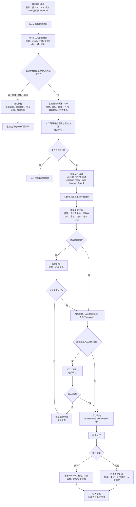

## Agent 发起链上动作执行流程图

---

## 哪些步骤可以自动化，哪些必须人工确认

| 阶段               | 可自动化                               | 必须人工确认                  | 原因              |
| ---------------- | ---------------------------------- | ----------------------- | --------------- |
| 任务理解             | 解析自然语言、识别链、token、目标动作              | 第一次真实资产任务意图             | 防止 Agent 误解用户目标 |
| 信息查询             | 查余额、查报价、查合约 ABI、查交易状态              | 通常不需要                   | 只读动作风险低         |
| 交易模拟             | eth_call、Tenderly/本地模拟、滑点估算、gas 估算 | 通常不需要                   | 模拟不改变链上状态       |
| 授权创建             | Agent 可生成授权草案                      | **必须确认**                | 授权边界决定资产风险      |
| 小额低风险交易          | 可在策略内自动执行                          | 超阈值时确认                  | 提高效率，同时限制损失     |
| approve / permit | 不建议默认自动                            | **必须确认，尤其是无限授权**        | 授权风险常高于单次转账     |
| 转账               | 小额可自动                              | 超预算、陌生地址、跨链转账确认         | 资金不可逆           |
| 合约交互             | 白名单函数可自动                           | 未知合约、升级、delegatecall 确认 | 合约风险不可完全由自然语言判断 |
| 部署 / 升级合约        | 不建议自动                              | **必须确认**                | 影响长期权限和资产安全     |
| 治理投票             | 不建议自动                              | **必须确认**                | 涉及组织决策责任        |
| 失败恢复             | 自动暂停、告警、记录日志                       | 是否重试、是否人工接管             | 避免失败后扩大损失       |
| 权限撤销             | 到期自动撤销                             | 紧急撤销可由人触发               | 防止权限残留          |

---

## Agent Wallet 场景权限策略设计

### 场景设定

设计一个 **DeFi 资金管理助手 Agent**：

> 用户授权 Agent 在 Arbitrum 上管理一个测试资金池，用于 USDC / ETH 的小额换汇、跨协议收益查询和有限额度调仓。Agent 不能提走全部资产，不能调用未知合约，不能做无限 approve，不能部署合约，不能参与治理投票。

---

## 权限策略

### 基础权限边界

| 策略项      | 设计                                                                          |
| -------- | --------------------------------------------------------------------------- |
| 授权对象     | 用户的 Safe Smart Account 或 ERC-4337 Smart Account                             |
| Agent 身份 | 后端 Agent 服务 + 独立 signer / session key                                       |
| 授权类型     | 任务级临时授权                                                                     |
| 有效期      | 单次任务最多 2 小时                                                                 |
| 网络       | 仅 Arbitrum One                                                              |
| 资产范围     | USDC、WETH、ETH                                                               |
| 最大预算     | 单次任务最多 500 USDC 等值                                                          |
| 单笔上限     | 100 USDC 等值                                                                 |
| 日累计上限    | 500 USDC 等值                                                                 |
| 最大滑点     | 0.5%；超过必须人工确认                                                               |
| 可调用合约    | Uniswap Router、1inch Router、LI.FI 指定合约、Safe 官方合约                            |
| 禁止合约     | 未验证合约、代理升级合约、未知 router、黑名单地址                                                |
| 禁止动作     | 无限 approve、delegatecall、合约部署、合约升级、治理投票、转账到非白名单 EOA                          |
| 日志要求     | 任务 ID、授权 ID、调用参数、模拟结果、策略命中、签名者、tx hash、执行结果                                 |
| 撤销方式     | 用户在 Safe / Wallet UI 一键 revoke session key / disable module / remove policy |
| 失败处理     | 失败 1 次自动重试模拟；失败 2 次暂停；资产异常立即撤销权限并告警                                         |

---

### 可执行动作

| 动作                  | 是否允许自动执行 | 限制                                    |
| ------------------- | -------: | ------------------------------------- |
| 查询余额                |       允许 | 只读                                    |
| 查询 token 价格         |       允许 | 只读                                    |
| 查询 bridge / swap 报价 |       允许 | 只读                                    |
| 模拟交易                |       允许 | 不上链                                   |
| USDC → WETH swap    |       允许 | 白名单 router、单笔 ≤ 100 USDC、滑点 ≤ 0.5%    |
| WETH → USDC swap    |       允许 | 同上                                    |
| bridge 到其他链         |     条件允许 | 仅白名单桥、单笔 ≤ 50 USDC、必须模拟成功             |
| ERC-20 approve      |     条件允许 | 仅 exact amount，不允许 unlimited approval |
| 转账到用户自有地址           |     条件允许 | 地址必须预先白名单                             |
| 转账到陌生地址             |     禁止自动 | 必须人工确认                                |
| 合约部署                |       禁止 | 必须人工确认                                |
| 合约升级                |       禁止 | 必须人工确认                                |
| 治理投票                |     禁止自动 | 必须人工确认                                |
| 签署任意 message        |     禁止自动 | 必须人工确认，尤其是 Permit / 授权类签名             |

---

### 人工确认阈值

| 触发条件                  | 处理方式      |
| --------------------- | --------- |
| 单笔金额 > 100 USDC       | 暂停，要求人工确认 |
| 单日累计 > 500 USDC       | 暂停，要求人工确认 |
| 滑点 > 0.5%             | 暂停，要求人工确认 |
| 调用非白名单合约              | 拒绝执行      |
| 调用未知函数 selector       | 拒绝执行      |
| approve 金额 > 本次交易需要金额 | 暂停，要求人工确认 |
| 出现 unlimited approve  | 默认拒绝      |
| 交易模拟失败                | 拒绝执行      |
| 交易模拟结果包含资产异常流出        | 拒绝执行并告警   |
| 目标地址首次出现              | 暂停，要求人工确认 |
| Agent 请求延长权限          | 必须人工确认    |
| Agent 请求扩大预算          | 必须人工确认    |
| 任务超时                  | 自动撤销权限    |

---

## 失败处理机制

### 失败分类

| 失败类型     | 示例                         | 处理               |
| -------- | -------------------------- | ---------------- |
| 可恢复失败    | gas 波动、报价过期、RPC 超时         | 重新报价并模拟，最多重试 1 次 |
| 策略失败     | 超预算、滑点过高、合约不在白名单           | 拒绝执行，记录原因        |
| 链上失败     | tx reverted、bridge pending | 暂停后续动作，等待状态确认    |
| 安全失败     | 资产异常流出、未知 approve、目标地址异常   | 立即撤销权限并告警        |
| Agent 失败 | 计划和执行不一致、重复提交交易            | 停止 Agent，人工接管    |
| 用户侧失败    | 用户未确认、授权过期                 | 终止任务             |

---

### 最小日志字段

| 字段                             | 说明             |
| ------------------------------ | -------------- |
| task_id                        | 一次任务的唯一 ID     |
| pact_id / authorization_id     | 临时授权 ID        |
| agent_id                       | 发起操作的 Agent 身份 |
| wallet_address                 | 被代理的钱包         |
| chain_id                       | 网络             |
| contract_address               | 调用合约           |
| function_selector              | 调用函数           |
| calldata_hash                  | 参数哈希           |
| human_approval_id              | 人工确认记录         |
| simulation_result              | 模拟结果           |
| policy_check_result            | 策略校验结果         |
| tx_hash                        | 链上交易哈希         |
| before_balance / after_balance | 执行前后资产状态       |
| error_code                     | 失败类型           |
| recovery_action                | 暂停、撤销、重试、人工接管  |

---

## ERC-4337 为什么重要

### 它解决的问题

ERC-4337 的核心价值是让钱包变成 **可编程账户**。它引入 UserOperation、Bundler、EntryPoint、Paymaster 等组件，使智能账户可以支持自定义签名、批量交易、gas 代付、账户恢复和更灵活的验证逻辑。官方文档也明确把 smart accounts、bundlers、paymasters、custom signature schemes、batched calls 和 recovery 作为 ERC-4337 的关键能力。([ERC4337 文档][1])

### 对 Agent Wallet 的意义

| 风险               | ERC-4337 能提供的能力               |
| ---------------- | ----------------------------- |
| 私钥直接控制资产         | 用 smart account 替代纯 EOA 控制    |
| Agent 需要频繁请求用户签名 | 用 session key / policy 降低重复确认 |
| 用户没有 gas         | Paymaster 可代付 gas             |
| 多步操作容易失败         | 支持 batched calls，把多步动作组合执行    |
| 钱包丢失或权限异常        | 可设计恢复机制                       |
| 不同任务需要不同权限       | 可用智能账户逻辑做细粒度验证                |

### 局限

ERC-4337 **只提供账户抽象执行框架**，它本身不会自动定义“Agent 可以做什么”。权限策略、合约白名单、预算限制、风险分级、审计系统仍然需要应用层和钱包层设计。

---

## Safe 为什么重要

### 它解决的问题

Safe 的关键价值是 **组织级资产控制**。Safe Smart Account 支持定义多个 owner，并设置达到阈值后才能执行交易；这适合团队金库、DAO treasury、项目资金池、企业链上账户。Safe 官方文档说明，多签功能允许定义 owner 列表和 required threshold，达到阈值后交易才能执行。

### 对 Agent Wallet 的意义

| 风险           | Safe 能提供的能力                                  |
| ------------ | -------------------------------------------- |
| 单人误操作        | 多签阈值降低单点错误                                   |
| Agent 越权执行   | Agent 只能作为 proposer / module，关键交易仍需 owner 确认 |
| 团队资产无人负责     | owner 和 threshold 明确责任边界                     |
| 事后追责困难       | Safe 交易有链上记录和签名记录                            |
| 高频低风险动作需要自动化 | 可通过 module 扩展自动执行能力                          |

Safe Modules 是 Safe 的智能合约扩展，可以在核心多签机制之外启用自动化或自定义交易逻辑；这对 Agent 执行低风险动作有价值。

### 局限

Safe 解决的是 **多方控制与账户基础设施问题**，但单独使用 Safe 还不够。若给某个 module 过大权限，Agent 仍可能绕过人工确认。因此还需要 guard / policy 机制限制 module 和交易参数。

---

## Guard / Policy 机制为什么重要

### 它解决的问题

Guard / Policy 的价值是：**在交易执行前后做程序化限制**。

Safe Guards 可以在 Safe 交易前检查交易参数，也可以在交易执行后检查 Safe 的最终状态。官方文档明确说明，Guards 用于在 n-of-m 多签机制之上增加限制，并支持交易前检查和交易后检查。

### 对 Agent Wallet 的意义

| 风险                    | Guard / Policy 的处理方式          |
| --------------------- | ----------------------------- |
| Agent 调用错误合约          | 检查 to 地址是否在白名单                |
| Agent 调用危险函数          | 检查 function selector          |
| Agent 转出过多资产          | 检查 token、金额、余额变化              |
| Agent 使用 delegatecall | 直接禁止 delegatecall             |
| Agent 绕过多签规则          | 对 module transaction 也加 guard |
| 交易后状态异常               | 执行后检查 Safe 余额和授权状态            |
| 策略被绕过                 | 统一入口做链上或准链上约束                 |

Safe v1.5.0 引入的 Module Guards 就是为了给 module transaction 设置安全规则，避免 module 绕过原有 guard 规则。

### 局限

Guard / Policy 的安全性取决于策略质量。写错白名单、漏掉函数 selector、允许 delegatecall、允许无限 approve，都会让策略形同虚设。更现实的问题是：策略越细，维护成本越高；策略越宽，风险越大。

---

## ERC-4337、Safe、Guard / Policy 的分工

| 机制              | 主要解决什么     | 适合解决的风险                          | 不能单独解决什么         |
| --------------- | ---------- | -------------------------------- | ---------------- |
| ERC-4337        | 账户抽象与可编程执行 | 自定义签名、批量交易、gas 代付、恢复、session key | 不自动提供业务权限策略      |
| Safe            | 多签与组织级账户控制 | 团队资产、金库、多方审批、链上审计                | 不自动判断每笔交易是否安全    |
| Guard / Policy  | 交易级规则约束    | 合约白名单、函数限制、金额限制、状态检查             | 策略设计错误时无法兜底      |
| MPC             | 私钥分片和签名安全  | 单点私钥泄露、机构签名流程                    | 不等于链上权限最小化       |
| Task-level Pact | 单次任务临时授权   | Agent 越权、长期权限残留、任务边界不清           | 需要钱包、策略引擎和审计系统配合 |
